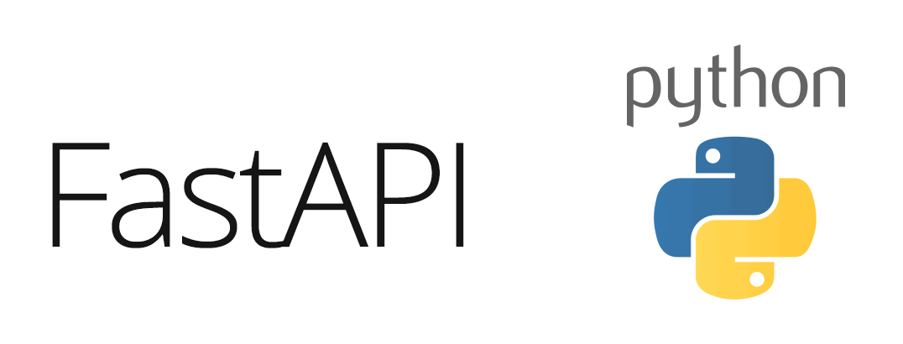

# Project Name: Exchange-Rates-API-FastApi

## Documentation

http://127.0.0.1:8000/docs

## Description

build virtual environment:

venv\Scripts\activate.ps1

## Installation

Provide instructions on how to install the project and its dependencies.

## Usage

uvicorn main:app

uvicorn main:app --port 5000 --reload

## Contributing

If you encourage contributions, outline the process for submitting code changes or reporting issues.

 ## Proposed folder structure:    

├── .env  
├── .venv                         
├── README.md                                                 
├── LICENSE                                                        
├── requirements.txt.py                    
├── main.py                                                                      
├── dockerfile                 
├── .gitignore                    
├── api.code-workspacee          
├── .dockerignore                 
├── utils/                              
├── templates/                
│   ├── email_templete/            
│   └── generic_templete/         
├── schemas/           
├── routes/                 
├── models/                 
├── middleware/                                
├── test/                    
├── controllers/           
├── config/                     
└── ...                 

## Clonar:

https://github.com/jhonshua/Backend-Parking-Lot.git

## documentacion:

https://app.getpostman.com/join-team?invite_code=271a7be96486bacc2dec27d68191660a9394da106257c2a95f0f06c120cc7210&target_code=ab019c3497d922e183c8e36e749ce4cb

**by: Julio cesar llinas**
**www.linkedin.com/in/julio-cesar-llinas-ba65a6127**